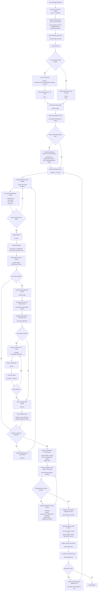
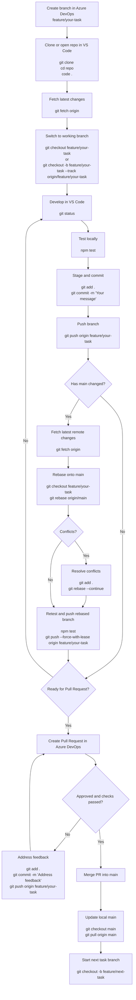
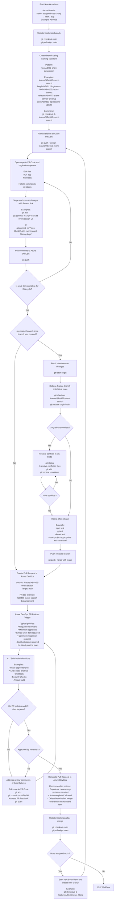
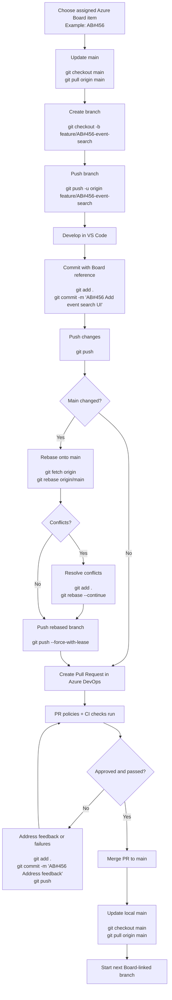

Absolutely — here is a **developer workflow Mermaid flowchart** with the **Git commands embedded in each step** for an **Azure DevOps Repo + VS Code workflow**.

This version assumes:

* the branch is created in **Azure DevOps**
* the developer then uses **VS Code** locally
* the developer fetches, checks out, commits, pushes, rebases when needed
* the developer creates a PR in Azure DevOps
* after merge, the developer updates `main` and starts again

## Azure DevOps + VS Code Developer Workflow with Git Commands



---

## Cleaned-up version for documentation handouts

This version is a bit tighter and easier for students or developers to read on a page.



---

## Recommended Git command set for the workflow

You could also place this under the diagram as a quick-reference legend.

### Initial setup

```bash
git clone https://dev.azure.com/org/project/_git/repo
cd repo
code .
```

### Get current changes

```bash
git fetch origin
git status
```

### Switch to branch

```bash
git checkout feature/event-search
```

### Create local tracking branch if needed

```bash
git checkout -b feature/event-search --track origin/feature/event-search
```

### Stage and commit

```bash
git add .
git commit -m "Implement event search improvements"
```

### Push branch

```bash
git push origin feature/event-search
```

### Rebase onto latest main

```bash
git fetch origin
git checkout feature/event-search
git rebase origin/main
```

### Resolve rebase conflicts

```bash
git status
git add .
git rebase --continue
```

### Push after rebase

```bash
git push --force-with-lease origin feature/event-search
```

### Update local main after merge

```bash
git checkout main
git pull origin main
```

### Start next branch

```bash
git checkout -b feature/next-task
```

---

## Small terminology correction

You wrote **“github commands”**, but because this workflow is for **Azure DevOps Repos**, these are really **Git commands**, not GitHub-specific commands. That said, the commands are the same because Azure DevOps Repos use standard Git.

## Best-practice note for the flowchart

For professional team use, I recommend this branch naming pattern:

```bash
feature/short-description
bugfix/short-description
hotfix/short-description
chore/short-description
```

Example:

```bash
feature/event-discovery-refactor
bugfix/pagination-filter-reset
```

I can also turn this into a **polished styled Mermaid diagram with color classes** so it looks more professional in course notes or Azure DevOps documentation.

Short answer: **Yes — in most professional teams it is better to create branches locally in VS Code using Git commands rather than through the Azure DevOps UI.** 👍

Creating the branch locally has several advantages for a **DevOps-style workflow**.

---

# Recommended Best Practice

## Create the Branch Locally (VS Code / Git)

Typical professional workflow:

1. Update `main`
2. Create the branch locally
3. Start work
4. Push the branch
5. Azure DevOps automatically recognizes the branch

Example:

```bash
git checkout main
git pull origin main
git checkout -b feature/event-search
git push -u origin feature/event-search
```

After the push:

* Azure DevOps will **automatically create the remote branch**
* The branch becomes visible under **Repos → Branches**
* You can then create a **Pull Request**

---

# Why Local Branch Creation is Preferred

### 1️⃣ Keeps `main` up to date first

Developers must update their local `main` before branching.

```bash
git checkout main
git pull origin main
```

This reduces merge conflicts later.

---

### 2️⃣ Ensures clean Git history

When branches are created from updated `main`, rebases become simpler.

---

### 3️⃣ Faster developer workflow

Developers stay inside **VS Code + Git** instead of switching to the browser.

Typical dev loop:

```
VS Code
 ├─ create branch
 ├─ develop
 ├─ commit
 ├─ push
 └─ PR in Azure DevOps
```

---

### 4️⃣ Works naturally with Git tooling

Git tools assume branch creation locally.

Example:

```
git checkout -b feature/search-ui
```

---

# When You *Might* Create Branches in Azure DevOps

UI branch creation is occasionally used when:

| Situation                 | Reason                        |
| ------------------------- | ----------------------------- |
| release branches          | controlled by release manager |
| hotfix branches           | emergency production fix      |
| protected branch policies | central control               |
| onboarding juniors        | easier to visualize           |

Example:

```
release/2026.03
hotfix/security-patch
```

But **for day-to-day development**, teams rarely use the UI.

---

# Ideal Developer Workflow (Industry Standard)

### Step 1 — Update main

```bash
git checkout main
git pull origin main
```

---

### Step 2 — Create feature branch

```bash
git checkout -b feature/event-search
```

---

### Step 3 — Push branch

```bash
git push -u origin feature/event-search
```

`-u` sets upstream so future pushes are simple.

---

### Step 4 — Work normally

```bash
git add .
git commit -m "Add event search filtering"
git push
```

---

### Step 5 — Rebase when main changes

```bash
git fetch origin
git rebase origin/main
```

---

### Step 6 — Pull Request in Azure DevOps

```
feature/event-search → main
```

---

# Recommended Branch Naming Best Practice

Typical structure:

```
type/scope-description
```

Examples:

```
feature/event-search
feature/user-authentication
bugfix/pagination-reset
hotfix/security-patch
refactor/event-service
docs/readme-update
```

Very DevOps-friendly pattern:

```
feature/123-event-search
bugfix/412-login-error
```

Where `123` is the **Azure Boards work item ID**.

---

# Recommendation for Your Mermaid Workflow

Since you're teaching **Azure DevOps + VS Code**, the best workflow is:

1️⃣ **Update main**

2️⃣ **Create branch locally**

3️⃣ **Push branch**

4️⃣ **Azure DevOps detects branch**

5️⃣ **PR**

This matches **real-world DevOps pipelines and GitFlow-lite workflows**.

---

# What I Recommend for Your Course Material

Your Mermaid diagram should start with:

```
Update main
↓
Create branch locally
↓
Push branch to Azure DevOps
↓
Develop / commit / push
↓
Rebase when main changes
↓
Pull Request
↓
Merge
```

This will teach students the **correct professional Git workflow**.

---

✅ If you'd like, I can also generate a **“Professional Azure DevOps Developer Workflow Diagram”** that:

* includes **Git commands**
* includes **Azure Boards linking**
* includes **branch naming standards**
* shows **PR policies and CI checks**

This becomes a **fantastic DevOps poster for students**.

Absolutely — here is a **Professional Azure DevOps Developer Workflow Diagram** in **Mermaid** that includes:

* **Git commands**
* **Azure Boards linking**
* **branch naming standards**
* **PR policies and CI checks**
* **rebase workflow**
* **review / feedback loop**
* **merge and next-branch continuation**

---

## Professional Azure DevOps Developer Workflow Diagram



---

## Recommended Branch Naming Standard

Use a consistent format that ties directly to Azure Boards:

```text
type/AB#workitemid-short-description
```

### Examples

```text
feature/AB#456-event-search
bugfix/AB#912-login-error
hotfix/AB#1021-auth-timeout
refactor/AB#777-event-service-cleanup
docs/AB#333-api-readme-update
test/AB#804-auth-unit-tests
chore/AB#650-update-dependencies
```

This gives you:

* traceability to **Azure Boards**
* clean branch organization
* easier PR review
* better reporting across work items and commits

---

## Git Command Reference for the Workflow

### 1. Update `main`

```bash
git checkout main
git pull origin main
```

### 2. Create a new branch

```bash
git checkout -b feature/AB#456-event-search
```

### 3. Push the branch and set upstream

```bash
git push -u origin feature/AB#456-event-search
```

### 4. Commit with Azure Boards reference

```bash
git add .
git commit -m "AB#456 Add event search UI"
```

To automatically close or transition work items depending on configuration:

```bash
git commit -m "Fixes AB#456 Add event search filtering logic"
```

### 5. Push work

```bash
git push
```

### 6. Rebase when `main` changes

```bash
git fetch origin
git checkout feature/AB#456-event-search
git rebase origin/main
```

### 7. Resolve conflicts

```bash
git status
git add .
git rebase --continue
```

### 8. Push after rebase

```bash
git push --force-with-lease
```

### 9. Update local `main` after merge

```bash
git checkout main
git pull origin main
```

---

## Professional PR Policy / CI Checklist

You can use these as the standard shown in your documentation or course notes.

### Pull Request Policies

* branch must target `main`
* branch must be linked to an **Azure Boards** work item
* minimum reviewer approval required
* all reviewer comments must be resolved
* direct commits to `main` blocked
* stale approvals reset when new commits are pushed

### CI / Build Validation Checks

* dependency restore/install
* linting / formatting validation
* unit tests
* integration tests if applicable
* security / secret scanning
* successful build / package generation

---

## Optional Student-Friendly Version

Here is a cleaner, slightly more compact version if you want one for handouts or slides.



---

## Suggested Team Standards Block

You may want to place this under the diagram in your developer docs:

```text
Branch naming:
type/AB#workitemid-short-description

Commit format:
AB#workitemid Short action description

Examples:
feature/AB#456-event-search
bugfix/AB#912-login-error

Example commit:
AB#456 Add event search filtering
```

If you want, I can next generate a **polished color-styled Mermaid version with swimlanes for Developer / Azure DevOps / CI Pipeline**.
