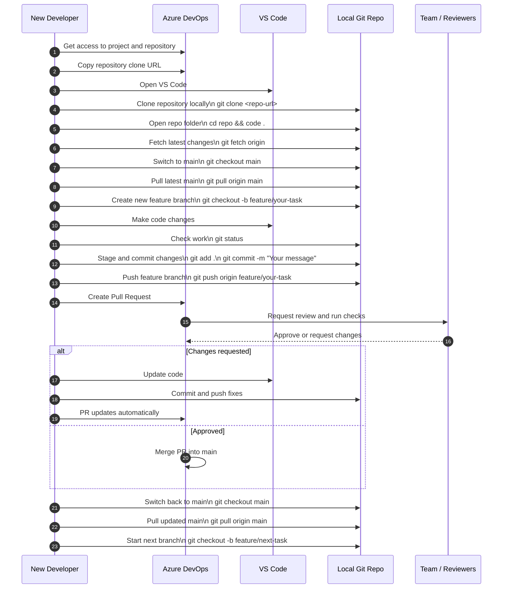
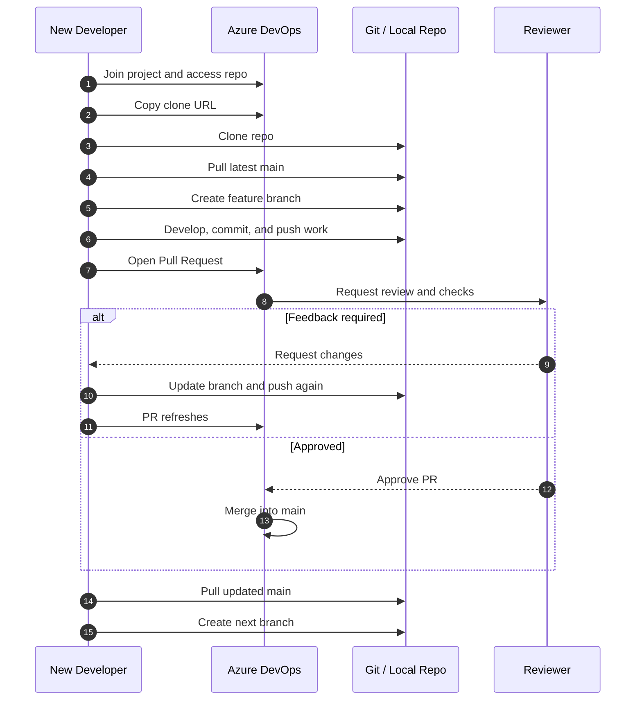

Here is a simplified Mermaid **sequence diagram** from the perspective of a **new developer joining the team**, focusing only on the key onboarding and workflow steps:

This version keeps the story very clean:

* get access
* clone repo
* sync main
* create branch
* develop
* push
* open PR
* respond to review
* merge
* sync again

Here is an even more beginner-friendly version if you want it framed as **Day 1 developer onboarding workflow**:

For teaching, I would recommend the **first version** because it is still simple but includes the concrete development actions students actually perform.
