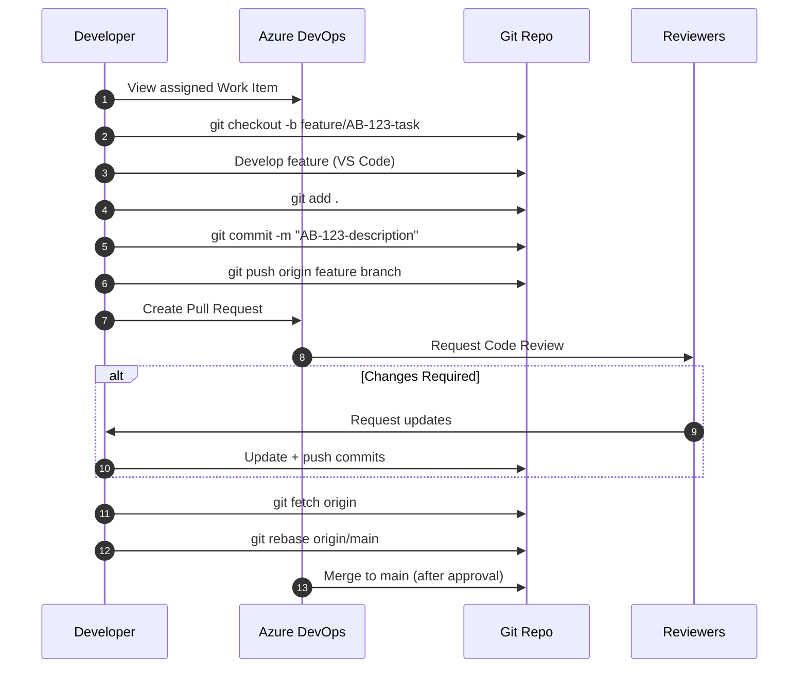

# **PROG2700 – Client-Side Programming**

## **Mini-Project 1 (MP1): Front-End Development (Tailwind v4)**

### **Group DevOps Project – CORAH Web Application**

---

## **1. Assignment Details**

| Item               | Value                             |
| ------------------ | --------------------------------- |
| **Type**           | Group Mini-Project                |
| **Weight**         | 15–20% (Instructor Defined)       |
| **Estimated Time** | 10–15 hours                       |
| **Delivery Mode**  | In-Class + Lab                    |
| **Due Date**       | *Instructor to specify*           |
| **Submission**     | Azure DevOps Repo + Pull Requests |

---

## **2. Overview / Purpose / Objectives**

This project introduces students to **modern front-end development within a DevOps team environment**.

Students will work collaboratively to transform a base CORAH web application into a **responsive, accessible, and visually consistent interface** using **Tailwind CSS v4**.

The focus is not just UI development—but **how professional developers work together** using:

* Git workflows
* Azure DevOps Boards
* Branching strategies
* Pull Requests and code reviews

---

## **3. Learning Outcomes Addressed (PROG2700)**

| Outcome | Description                                                                               |
| ------- | ----------------------------------------------------------------------------------------- |
| **LO1** | Demonstrate proficiency in JavaScript (applied where needed)                              |
| **LO2** | Demonstrate DOM manipulation for UI behavior                                              |
| **LO3** | Work with client-side applications interacting with APIs *(future integration readiness)* |
| **LO4** | Apply third-party libraries (Tailwind CSS v4)                                             |
| **LO5** | Apply CSS libraries to enhance UI/UX                                                      |

---

## **4. Assignment Description / Use Case**

You are part of a **frontend development team** working on the **CORAH Web Application**, a platform designed for managing events and user engagement.

Your task is to:

> Transform basic HTML templates into a **professional-grade UI** using Tailwind CSS while working within a **structured DevOps workflow**.

You will not work alone—this is a **team-based project** simulating real industry practices.

---

## **5. Tasks / Instructions**

### **Phase 1 – Environment Setup**

* Clone the Azure DevOps repository
* Open project in VS Code
* Ensure Tailwind v4 is configured and compiling
* Verify project runs locally

---

### **Phase 2 – DevOps Workflow Setup**

* Review assigned **Azure Board work items**
* Create feature branch using naming convention:

```bash
git checkout -b feature/AB-123-navbar
```

---

### **Phase 3 – UI Development (Tailwind)**

Students must apply Tailwind styling to assigned components/pages.

Focus on:

* Layout structure
* Typography
* Spacing and alignment
* Responsive design
* Accessibility

---

### **Phase 4 – Git Workflow & Collaboration**

For each task:

```bash
git add .
git commit -m "AB-123-Implement-navbar-layout"
git push origin feature/AB-123-navbar
```

* Create Pull Request (PR)
* Link PR to Azure Board work item
* Address feedback
* Rebase if needed:

```bash
git fetch origin
git rebase origin/main
```

---

### **Phase 5 – Integration**

* Ensure UI consistency across pages
* Resolve merge conflicts
* Validate responsiveness
* Prepare final polished interface

---

## **6. DevOps Workflow Diagram (Student Reference)**



---

## **7. Deliverables**

Students must submit:

### **Individual**

* Contributions via commits (visible in Git history)
* Completed assigned work items
* Participation in PR process

### **Group**

* Fully styled CORAH interface
* Clean, consistent UI across all pages
* Functional responsive design
* No broken layouts or major UI issues

---

## **8. Tailwind Component Checklist**

Students are expected to implement and/or style:

### **Core Layout**

* ☐ Navigation bar (responsive)
* ☐ Footer
* ☐ Page container layout (grid/flex)

### **UI Components**

* ☐ Buttons (primary, secondary, hover states)
* ☐ Forms (inputs, labels, validation styles)
* ☐ Cards (event listings)
* ☐ Modals or overlays (if applicable)

### **Typography**

* ☐ Heading hierarchy
* ☐ Body text readability
* ☐ Consistent spacing

### **Responsiveness**

* ☐ Mobile layout
* ☐ Tablet layout
* ☐ Desktop layout

### **UX Enhancements**

* ☐ Hover states
* ☐ Focus states (accessibility)
* ☐ Transitions (optional but encouraged)

---

## **9. Assessment & Rubric**

### **Rubric Overview (Aligned to PROG2700 Outcomes)**

| Criteria                     | Description                                                     | Outcome  | Weight |
| ---------------------------- | --------------------------------------------------------------- | -------- | ------ |
| **Tailwind Implementation**  | Correct and effective use of Tailwind classes and design system | LO4, LO5 | 25%    |
| **UI/UX Quality**            | Visual consistency, responsiveness, accessibility               | LO5      | 20%    |
| **DevOps Workflow**          | Proper use of Git, branching, commits, PRs                      | LO1      | 20%    |
| **Code Quality**             | Clean, readable, maintainable code                              | LO1, LO2 | 15%    |
| **Team Collaboration**       | Participation, communication, PR engagement                     | —        | 10%    |
| **Completion of Work Items** | Tasks completed as assigned                                     | —        | 10%    |

---

### **Performance Levels**

| Level                       | Description                                                      |
| --------------------------- | ---------------------------------------------------------------- |
| **Excellent (A)**           | Professional-quality UI, flawless workflow, strong collaboration |
| **Good (B)**                | Solid implementation with minor issues                           |
| **Satisfactory (C)**        | Meets minimum requirements with inconsistencies                  |
| **Needs Improvement (D/F)** | Incomplete, poor workflow, or broken UI                          |

---

## **10. Submission Guidelines**

* All work must be committed to **Azure DevOps repository**
* All features must be submitted via **Pull Requests**
* Final code must be merged into **main branch**
* No direct commits to main (unless instructed)

---

## **11. Resources / Equipment**

* VS Code
* Azure DevOps Repo (NSCC SAITGE Server)
* Git CLI
* Tailwind CSS v4
* Course-provided starter project

---

## **12. Academic Policies**

* All work must be your own contribution within the team
* Git history will be used to verify participation
* Academic integrity policies apply

---

## **13. Instructor Notes (Optional)**

* Encourage real-world workflow discipline
* Evaluate Git logs, not just final UI
* Use PR discussions as part of grading evidence

---

## **💡 Optional Enhancements (Bonus)**

* Dark/light mode toggle
* Advanced animations
* Improved accessibility (ARIA roles, keyboard nav)

---
