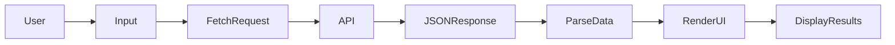
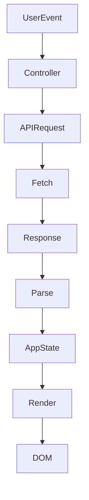

# **PROG2700 — Mini-Project 2 (MP2)**

## **Public API Explorer UI (Vanilla JavaScript + Tailwind CSS)**

---

## **1. Assignment Details**

| Field                | Information                         |
| -------------------- | ----------------------------------- |
| **Course**           | PROG2700                            |
| **Mini-Project**     | MP2 — Public API Explorer UI        |
| **Type**             | Individual                          |
| **Weight**           | (Instructor will specify)           |
| **Estimated Effort** | 8–12 hours                          |
| **Delivery Mode**    | In-class + asynchronous development |
| **Due**              | (Instructor will specify)           |

---

# **2. Overview / Purpose / Objectives**

## Overview

In this mini-project you will **select a public Web API**, study how it works, and develop a **modern user interface (UI)** that retrieves and displays its data using:

* **Vanilla JavaScript**
* **DOM manipulation**
* **Tailwind CSS**

You will **not use JavaScript frameworks** such as React, Angular, or Vue.
The goal is to demonstrate that you understand **core JavaScript programming and browser APIs**.

The application should provide a **clean user experience** and present API data in a **clear and visually appealing format**.

Paging is **not required**, but your UI must remain usable and readable.

---

## Purpose

This project simulates a **real front-end developer workflow**:

1. Read API documentation
2. Test endpoints
3. Retrieve data from a remote service
4. Transform and display results
5. Build a professional user interface

This process is extremely common in **modern web development**, where applications frequently rely on **external APIs and services**.

---

## Objectives

By completing this mini-project you will practice:

* Designing a **client-side application architecture**
* Using **JavaScript fetch()** to retrieve remote data
* Manipulating the **DOM to update user interfaces**
* Building a **responsive modern UI with Tailwind**
* Structuring and documenting a **professional GitHub project**

---

# **3. Learning Outcomes Addressed**

## Outcome 1

**Demonstrate a proficient understanding of the JavaScript programming language in order to develop client-side web apps without the use of frameworks / libraries.**

You will demonstrate this by:

* Writing modular JavaScript code
* Using functions and asynchronous logic
* Implementing `fetch()` with `async / await`
* Processing JSON data returned by APIs
* Structuring a small front-end application

---

## Outcome 2

**Demonstrate proficiency in DOM manipulation for the development of client-side applications.**

You will demonstrate this by:

* Dynamically generating UI components
* Updating page content based on API results
* Handling user events such as searches or filters
* Displaying results using DOM rendering functions

---

## Outcome 3

**Develop client-side applications that retrieve and send data to a web API through a variety of different data exchange formats.**

You will demonstrate this by:

* Connecting to a public API endpoint
* Retrieving JSON data
* Parsing and transforming returned data
* Displaying structured information in your UI

---

## Outcome 5

**Apply CSS libraries / preprocessors to enhance the visual interface and usability of client-side applications.**

You will demonstrate this by:

* Using **Tailwind CSS** to design a modern UI
* Creating responsive layouts
* Designing accessible, readable interface elements
* Improving usability through consistent visual structure

---

# **4. Assignment Description / Use Case**

## The Application

You will build a **Public API Explorer**.

This application allows a user to:

* Enter a **search query or parameter**
* Send a request to an **external API**
* Display results in a **clean user interface**

The application should feel like a **small real-world web product**.

---

## Example Public APIs

You may choose **any public API**, provided it is accessible from the browser and returns JSON.

Suggested APIs include:

* Shopify APIs
* NewsAPI
* TheSportsDB
* The Movie Database (TMDB)
* RAWG Video Games Database API
* NASA APIs
* GitHub API
* Pokémon API (PokeAPI)
* Spotify API

If you choose another API, ensure it:

* Provides public documentation
* Supports HTTP requests
* Returns JSON responses
* Allows browser-based access (CORS enabled)

---

# **5. Tasks / Instructions**

---

# **Part A — Investigate Your API**

Before coding, you must **learn how the API works**.

Review the documentation and identify:

* Base API URL
* One endpoint you will use
* Required parameters
* Optional parameters
* Example responses

Test your endpoint in a browser or API tool.

Example request pattern:

```
https://api.example.com/search?q=term
```

Create a short document explaining how your API works.

---

# **Part B — Create the Project Environment**

You will develop the project using **VS Code**.

Recommended tools:

* VS Code
* Node.js (LTS)
* Vite (simple development server)

---

## Step 1 — Create the project

```
npm create vite@latest prog2700-mp2 -- --template vanilla
cd prog2700-mp2
npm install
```

---

## Step 2 — Install Tailwind CSS

```
npm install -D tailwindcss postcss autoprefixer
npx tailwindcss init -p
```

---

## Step 3 — Configure Tailwind

Edit `tailwind.config.js`

```
export default {
  content: ["./index.html", "./src/**/*.{js,ts}"],
  theme: {
    extend: {},
  },
  plugins: [],
}
```

---

## Step 4 — Add Tailwind directives

Create or edit `src/style.css`

```
@tailwind base;
@tailwind components;
@tailwind utilities;
```

---

## Step 5 — Import CSS

In `src/main.js`

```
import "./style.css";
```

---

## Step 6 — Run the development server

```
npm run dev
```

---

### Memory Jog

If Tailwind styles do not appear, the most common issue is an **incorrect `content` path in `tailwind.config.js`**.

---

# **Part C — Build the User Interface**

Your application must include:

### Required UI components

* Application **header**
* Short **description of the application**
* A **search or input interface**
* A **results display section**

---

### Required UX states

Your UI should handle:

| State   | Description                    |
| ------- | ------------------------------ |
| Idle    | Page loaded, waiting for input |
| Loading | API request in progress        |
| Success | Results displayed              |
| Empty   | No results returned            |
| Error   | Friendly error message         |

---

### Interface Expectations

Your interface should:

* Look modern and readable
* Use Tailwind layout utilities
* Be responsive (desktop and mobile)
* Present results clearly (cards, table, list)

Paging is **not required**.

However, your UI should remain readable and organized.

---

# **Part D — Implement API Integration**

Your JavaScript code must:

* Use `fetch()` to retrieve data
* Use `async / await`
* Parse JSON responses
* Render results to the DOM

Example pattern:

```javascript
async function getData(url) {
    const response = await fetch(url);

    if (!response.ok) {
        throw new Error("API request failed");
    }

    return await response.json();
}
```

Your application should separate logic such as:

* API requests
* UI rendering
* Event handling

---

# **6. Deliverables**

Students will submit **two links**.

### 1. GitHub Repository Link

Students must create a new repository named:

```
wXXXXXXX-PROG2700-MP2
```

Replace `XXXXXXX` with your **student ID**.

Example:

```
w0123456-PROG2700-MP2
```

Your repository must contain the full project source code.

---

### 2. GitHub Pages URL

You must deploy your application using **GitHub Pages**.

Submit the live website URL.

Example:

```
https://username.github.io/w0123456-PROG2700-MP2
```

---

# **Important Notice — Public Repository**

Your GitHub repository will be **publicly visible on the internet**.

This means:

* Anyone can view your code
* Anyone can see your commit history
* Anyone can see files in your repository

### Do NOT include:

* API keys
* passwords
* personal information
* private data

You are responsible for ensuring your repository **does not expose sensitive information**.

---

# **7. Required Documentation (GitHub Standard)**

Your repository must include professional documentation.

Required files:

```
README.md
docs/api-notes.md
docs/reflection.md
```

---

### README.md must include:

* Project title
* API used
* Description of the application
* Instructions for running the project
* Screenshots of the interface
* GitHub Pages link

---

### API Notes Document

Explain:

* API name
* Endpoint used
* Parameters used
* Example response format

---

### Reflection Document

Answer the following:

1. What challenges did you encounter when integrating the API?
2. How did you structure your JavaScript application?
3. How did your UI respond to loading and error states?
4. What improvements would you make with more time?

---

# **8. Assessment & Rubric**

| Category           | Criteria                                 | Weight |
| ------------------ | ---------------------------------------- | ------ |
| API Integration    | Correct endpoint usage and data handling | 25%    |
| JavaScript Quality | Code structure, async handling, logic    | 25%    |
| DOM Manipulation   | Rendering pipeline and user interaction  | 20%    |
| Tailwind UI        | Visual design and usability              | 20%    |
| Documentation      | GitHub documentation and reflection      | 10%    |

---

# **9. Submission Guidelines**

Submit the following to Brightspace:

1. **GitHub repository link**
2. **GitHub Pages website URL**

Ensure your repository:

* is named correctly
* is publicly accessible
* contains working code
* includes documentation

---

# **10. Resources / Equipment**

Required tools:

* VS Code
* Node.js
* GitHub
* GitHub Pages
* Tailwind CSS
* Public Web API documentation

---

# **Memory Jogger — API Flow**



---

# **Memory Jogger — Application Architecture**



---


