# Workshop 03c: End-to-End Django Web Application with Tailwind Design System

## *Corah-Ready CSS Architecture • Light/Dark Themes • Containers*

---

## 1. Assignment Details

| Item                   | Description                                                   |
| ---------------------- | ------------------------------------------------------------- |
| **Course**             | WEBD / PROG / DBAS Integration                                |
| **Workshop Title**     | End-to-End Django Web Application with Tailwind Design System |
| **Type**               | Applied Architecture Workshop                                 |
| **Estimated Time**     | 6–8 hours (recommended over multiple classes)                 |
| **Environment**        | Docker + Docker Compose                                       |
| **Database**           | PostgreSQL                                                    |
| **Assessment Type**    | Graded Practical                                              |
| **Portfolio Artifact** | ✅ Yes — “Corah UI Architecture Starter”                       |

---

## 2. Target Project Structure (Final Outcome)

Students must end with **exactly this structure**.

```
corah-ui-starter/
├── .env
├── docker-compose.yml
├── Dockerfile
├── requirements.txt
├── package.json
├── tailwind.config.js
├── tokens.js
├── manage.py
│
├── config/
│   ├── __init__.py
│   ├── settings.py
│   ├── urls.py
│   ├── asgi.py
│   └── wsgi.py
│
├── website/
│   ├── __init__.py
│   ├── admin.py
│   ├── apps.py
│   ├── models.py
│   ├── views.py
│   ├── urls.py
│   └── migrations/
│
├── templates/
│   ├── base/
│   │   └── base.html
│   ├── includes/
│   │   ├── header.html
│   │   └── footer.html
│   └── pages/
│       ├── home.html
│       ├── about.html
│       └── events.html
│
└── static/
    ├── css/
    │   └── app.css          ← generated by Tailwind
    └── src/
        └── tailwind.css     ← tokens + theme layer
```

> This structure mirrors how **Corah** is organized and must be followed exactly.

---

## 3. Visual Architecture Diagram

```mermaid
flowchart TD
A[Design Decisions<br/>Brand · Spacing · Typography] --> B[Design Tokens<br/>CSS Variables]
B --> C[Theme Layer<br/>Light / Dark Values]
C --> D[Tailwind Config<br/>Semantic Utilities]
D --> E[Django Templates<br/>base · includes · pages]
E --> F[Rendered UI<br/>Consistent · Theme-Safe]
```




---

## 4. Learning Outcomes

By completing this workshop, students will be able to:

* Build a Django web application from scratch
* Run Django and PostgreSQL inside containers
* Implement a professional CSS architecture
* Use design tokens as a single source of truth
* Apply Tailwind as a constraint-based styling layer
* Support light and dark themes correctly
* Prepare safely for modifying the live Corah project

---

# ✅ PART A — Environment Setup

### Required software

* Docker Desktop (running)
* VS Code
* VS Code Docker extension (recommended)

Verify:

```bash
docker --version
docker compose version
```

---

# ✅ PART B — Create the Project

```bash
mkdir corah-ui-starter
cd corah-ui-starter
code .
```

Create folders:

```bash
Using linux/wsl

mkdir config website templates static
mkdir templates/base templates/includes templates/pages
mkdir static/css static/src
```

```Powershell
Using Powershell

New-Item -ItemType Directory -Path config, website, templates, static
New-Item -ItemType Directory -Path templates/base, templates/includes, templates/pages
New-Item -ItemType Directory -Path static/css, static/src
```

---

# ✅ PART C — Container Configuration

## `/ (root of project directory)`

## `.env`

```env
DEBUG=1
SECRET_KEY=dev-secret-key

POSTGRES_DB=corahdb
POSTGRES_USER=corahuser
POSTGRES_PASSWORD=corahpass
POSTGRES_HOST=db
POSTGRES_PORT=5432
```

---
## `/ (root of project directory)`

## `requirements.txt`

```txt
Django>=5.1
psycopg[binary]
python-decouple
```

---

## `/ (root of project directory)`

## `Dockerfile`

```dockerfile
FROM python:3.12-slim

WORKDIR /app

RUN apt-get update && apt-get install -y nodejs npm

COPY requirements.txt .
RUN pip install -r requirements.txt

COPY package.json .
RUN npm install

COPY . .

EXPOSE 8000
```

---

## `/ (root of project directory)`

## `docker-compose.yml`

```yaml
services:
  web:
    build: .
    command: bash -lc "python manage.py migrate && python manage.py runserver 0.0.0.0:8000"
    volumes:
      - .:/app
    ports:
      - "8000:8000"
    env_file:
      - .env
    depends_on:
      - db

  db:
    image: postgres:16
    environment:
      POSTGRES_DB: ${POSTGRES_DB}
      POSTGRES_USER: ${POSTGRES_USER}
      POSTGRES_PASSWORD: ${POSTGRES_PASSWORD}
    volumes:
      - postgres_data:/var/lib/postgresql/data

volumes:
  postgres_data:
```

---

# ✅ PART D — Create Django Project

```bash
docker compose run --rm web bash
django-admin startproject config .
python manage.py startapp website
exit
```

---

# ✅ PART E — Django Configuration

### `config/settings.py`

Add:

```python
from decouple import config as env
```

Set:

```python
SECRET_KEY = env("SECRET_KEY")
DEBUG = env("DEBUG") == "1"
```

Add app:

```python
INSTALLED_APPS += ["website"]
```

Templates:

```python
TEMPLATES[0]["DIRS"] = [BASE_DIR / "templates"]
```

Static:

```python
STATIC_URL = "static/"
STATICFILES_DIRS = [BASE_DIR / "static"]
```

Database:

```python
DATABASES = {
    "default": {
        "ENGINE": "django.db.backends.postgresql",
        "NAME": env("POSTGRES_DB"),
        "USER": env("POSTGRES_USER"),
        "PASSWORD": env("POSTGRES_PASSWORD"),
        "HOST": env("POSTGRES_HOST"),
        "PORT": env("POSTGRES_PORT"),
    }
}
```

---

# ✅ PART F — URLs and Views

## `website/views.py`

```python
from django.shortcuts import render

def home(request):
    return render(request, "pages/home.html")

def about(request):
    return render(request, "pages/about.html")

def events(request):
    return render(request, "pages/events.html")
```

---

## `website/urls.py`

```python
from django.urls import path
from . import views

urlpatterns = [
    path("", views.home, name="home"),
    path("about/", views.about, name="about"),
    path("events/", views.events, name="events"),
]
```

---

## `config/urls.py`

```python
from django.contrib import admin
from django.urls import path, include

urlpatterns = [
    path("admin/", admin.site.urls),
    path("", include("website.urls")),
]
```

---

# ✅ PART G — Tailwind + Tokens + Themes

## `package.json`

```json
{
  "private": true,
  "devDependencies": {
    "tailwindcss": "^3.4.0"
  },
  "scripts": {
    "tw:build": "tailwindcss -i ./static/src/tailwind.css -o ./static/css/app.css",
    "tw:watch": "tailwindcss -i ./static/src/tailwind.css -o ./static/css/app.css --watch"
  }
}
```

---

## `tokens.js`

```js
module.exports = {
  colors: {
    brand: {
      primary: "var(--brand-primary)",
      secondary: "var(--brand-secondary)"
    },
    surface: {
      1: "var(--surface-1)",
      2: "var(--surface-2)"
    },
    text: {
      1: "var(--text-1)",
      2: "var(--text-2)"
    },
    border: "var(--border)"
  }
};
```

---

## `tailwind.config.js`

```js
const tokens = require("./tokens");

module.exports = {
  darkMode: "class",
  content: ["./templates/**/*.html", "./website/**/*.py"],
  theme: {
    extend: {
      colors: tokens.colors,
      fontFamily: {
        base: ["Poppins", "sans-serif"]
      }
    }
  }
};
```

---

## `static/src/tailwind.css`

```css
@tailwind base;
@tailwind components;
@tailwind utilities;

@layer base {
  :root {
    --brand-primary: #7B458F;
    --brand-secondary: #5E2E73;
    --surface-1: #ffffff;
    --surface-2: #f6f7fb;
    --text-1: #111827;
    --text-2: #4b5563;
    --border: #e5e7eb;
  }

  .dark {
    --brand-primary: #9b63b0;
    --brand-secondary: #7d3c97;
    --surface-1: #0b1220;
    --surface-2: #111a2e;
    --text-1: #f9fafb;
    --text-2: #cbd5e1;
    --border: #243049;
  }
}
```

---

# ✅ PART H — Templates (Complete Starter Code)

Students must create **all files below exactly**.

---

## `/templates/base/base.html`

```html

<!doctype html>
<html lang="en">
<head>
  <meta charset="utf-8" />
  <meta name="viewport" content="width=device-width, initial-scale=1" />
  <title>Corah UI Starter</title>

  <!-- Tailwind compiled output -->
  <link rel="stylesheet" href="">
</head>

<body class="min-h-screen bg-surface-1 text-text-1 font-base">

  

  <main class="max-w-6xl mx-auto px-6 py-10">
    
  </main>

  

  <!-- Theme Toggle Script -->
  <script>
    const root = document.documentElement;
    const stored = localStorage.getItem("theme");

    function setTheme(theme) {
      theme === "dark"
        ? root.classList.add("dark")
        : root.classList.remove("dark");
    }

    if (stored) {
      setTheme(stored);
    } else {
      const prefersDark =
        window.matchMedia("(prefers-color-scheme: dark)").matches;
      setTheme(prefersDark ? "dark" : "light");
    }

    document.getElementById("themeToggle")?.addEventListener("click", () => {
      const next = root.classList.contains("dark") ? "light" : "dark";
      setTheme(next);
      localStorage.setItem("theme", next);
    });
  </script>

</body>
</html>
```

---

## `/templates/includes/header.html`

```html
<header class="border-b border-border bg-surface-1">
  <div class="max-w-6xl mx-auto px-6 py-4 flex items-center justify-between">

    <a href="" class="font-semibold tracking-tight">
      Corah
    </a>

    <nav class="flex gap-6 text-text-2">
      <a href="" class="hover:text-text-1">Home</a>
      <a href="" class="hover:text-text-1">About</a>
      <a href="" class="hover:text-text-1">Events</a>
    </nav>

    <div class="flex items-center gap-3">
      <button
        id="themeToggle"
        class="rounded-md border border-border px-3 py-2 text-sm hover:bg-surface-2"
      >
        Theme
      </button>

      <a
        href="#"
        class="rounded-md bg-brand-primary text-white px-4 py-2 text-sm font-medium hover:opacity-90"
      >
        Create Event
      </a>
    </div>

  </div>
</header>
```

---

## `/templates/includes/footer.html`

```html
<footer class="border-t border-border bg-surface-1">
  <div class="max-w-6xl mx-auto px-6 py-6 text-sm text-text-2">
    ©  Corah UI Architecture Starter — NSCC
  </div>
</footer>
```

---

## `/templates/pages/home.html`

```html

Home — Corah


<section class="space-y-10">

  <div class="space-y-4">
    <h1 class="text-4xl font-semibold tracking-tight">
      Corah UI Architecture Starter
    </h1>

    <p class="text-text-2 max-w-2xl">
      This project demonstrates a textbook CSS architecture using
      design tokens, Tailwind as the application layer, and Django
      templates for reuse.
    </p>

    <div class="flex gap-3">
      <a
        href="#"
        class="rounded-md bg-brand-primary text-white px-4 py-2 text-sm font-medium hover:opacity-90"
      >
        Get Started
      </a>

      <a
        href=""
        class="rounded-md border border-border px-4 py-2 text-sm font-medium hover:bg-surface-2"
      >
        Learn More
      </a>
    </div>
  </div>

  <div class="grid grid-cols-1 md:grid-cols-3 gap-4">
    <div class="rounded-xl border border-border p-5 bg-surface-1">
      <h3 class="font-semibold">Tokens First</h3>
      <p class="text-sm text-text-2 mt-2">
        All design decisions live in tokens, not scattered CSS rules.
      </p>
    </div>

    <div class="rounded-xl border border-border p-5 bg-surface-1">
      <h3 class="font-semibold">Theme Safe</h3>
      <p class="text-sm text-text-2 mt-2">
        Light and dark mode work automatically through token substitution.
      </p>
    </div>

    <div class="rounded-xl border border-border p-5 bg-surface-1">
      <h3 class="font-semibold">Reusable Templates</h3>
      <p class="text-sm text-text-2 mt-2">
        base / includes / pages prevent duplication and UI drift.
      </p>
    </div>
  </div>

</section>

```

---

## `/templates/pages/about.html`

```html

About — Corah


<section class="space-y-4">
  <h1 class="text-3xl font-semibold tracking-tight">
    About This Workshop
  </h1>

  <p class="text-text-2 max-w-2xl">
    This workshop exists to give you a full end-to-end example of how
    professional web applications structure CSS, templates, and tooling
    before working on a live system like Corah.
  </p>

  <div class="rounded-xl border border-border p-5 bg-surface-1">
    <h2 class="font-semibold">Key Principle</h2>
    <p class="text-sm text-text-2 mt-2">
      Design tokens define decisions. Tailwind applies decisions.
      Templates consume decisions.
    </p>
  </div>
</section>

```

---

## `/templates/pages/events.html`

```html

Events — Corah


<section class="space-y-6">

  <div class="flex items-end justify-between gap-4">
    <div>
      <h1 class="text-3xl font-semibold tracking-tight">Events</h1>
      <p class="text-text-2">
        Sample event cards using the same design system rules.
      </p>
    </div>

    <a
      href="#"
      class="rounded-md bg-brand-primary text-white px-4 py-2 text-sm font-medium hover:opacity-90"
    >
      Create Event
    </a>
  </div>

  <div class="grid grid-cols-1 md:grid-cols-3 gap-4">

    <div class="rounded-xl border border-border p-5 bg-surface-1">
      <h3 class="font-semibold">Orientation</h3>
      <p class="text-sm text-text-2 mt-2">
        Welcome event for new students and staff.
      </p>
    </div>

    <div class="rounded-xl border border-border p-5 bg-surface-1">
      <h3 class="font-semibold">Open House</h3>
      <p class="text-sm text-text-2 mt-2">
        Campus tours and program showcases.
      </p>
    </div>

    <div class="rounded-xl border border-border p-5 bg-surface-1">
      <h3 class="font-semibold">Networking Night</h3>
      <p class="text-sm text-text-2 mt-2">
        Connect with peers and industry professionals.
      </p>
    </div>

  </div>

</section>

```

---

# ✅ PART I — Build & Run

```bash
docker compose run --rm web npm run tw:build
docker compose up --build
```

Open:
👉 [http://localhost:8000](http://localhost:8000)

Test:

* navigation
* theme toggle
* pages
* database running

---

# 📊 Grading Rubric

| Criteria                                | Weight |
| --------------------------------------- | ------ |
| Project structure matches specification | 20%    |
| Docker + PostgreSQL functioning         | 20%    |
| Tailwind pipeline working               | 15%    |
| Tokens + semantic utilities used        | 15%    |
| Light/dark theme implementation         | 15%    |
| Template reuse (base/includes/pages)    | 10%    |
| Reflection quality                      | 5%     |

---

# 🧠 Reflection Questions

1. Where do design decisions live in this system?
2. Why are CSS variables used for tokens?
3. Why does Tailwind not own design decisions?
4. How does this architecture prevent UI drift?
5. How does this prepare you to modify Corah safely?

---

## ✅ Final Take-Aways

This workshop teaches students:

* end-to-end webapp construction
* containerized development
* professional CSS architecture
* design-system thinking
* production-safe workflows
