## **Workshop 08 – Client-Side State & UX Logic (NS Journey)**

---

## 1. Assignment Details

| Field                | Information                                                                                                  |
| -------------------- | ------------------------------------------------------------------------------------------------------------ |
| **Assignment Title** | Workshop 08 – Client-Side State & UX Logic (NS Journey Wizard)                                               |
| **Course Code**      | PROG2700                                                                                                     |
| **Type**             | Guided Hands-On Workshop                                                                                     |
| **Weight**           | Formative (Practice – Not Graded)                                                                            |
| **Estimated Time**   | 3–3.5 hours                                                                                                  |
| **Prerequisites**    | Workshops 06–07 (DOM, Events, Delegation, Validation)                                                        |
| **Tools Required**   | VS Code, Browser, DevTools, Mermaid Chart Extension (optional)                                               |
| **Context**          | NS Journey frontend uses **HTML/Tailwind/Vanilla JS** and will later interact with a **Django REST backend** |

---

## 2. Overview / Purpose / Objectives

Modern client-side apps are not just “pages” — they are interactive systems that must manage:

* what the user sees (wizard steps)
* what the user has entered (draft data)
* what happens after refresh (resume behavior)
* validation gates and feedback messages
* responsive UI controls

This workshop uses a real UI pattern (the **NS Journey multi-step wizard**) to teach a key industry idea:

> **Client-side applications are state machines.**
> **State drives the UI. The UI does not drive the state.**

## Production Clarification (GTFS + Data Sources Context)

In the production **NS Journey** system, completing this wizard will create:

* a **GTFS Route** (the logical service/path a rider will take)
* associated **GTFS Trips**

  * **Trip A:** **to** the destination (campus)
  * **Trip B:** **from** the destination (return trip)

In **Workshop 08**, we **simulate** this workflow by saving the draft locally (localStorage).
In later workshops, this becomes RESTful persistence:

* `POST /routes/`
* `POST /trips/` *(to-campus + from-campus)*

### Where wizard data comes from in production (important)

In the real system, several fields will not be “free text” — they will be driven by **API data** and client-side logic:

* **`origin_geoname`**

  * will retrieve validated place data from the backend **Geoname table/API**
  * will be implemented later using client-side API calls (e.g., **Axios**) and utility helpers (e.g., **Lodash**) to filter/search results

* **`origin_departure`**

  * will retrieve departure-time context from the backend **GTFS Stops table/API**
  * the UI will guide the student to select the appropriate stop / schedule-based departure time rather than typing arbitrary values

* **`stop_arrive_time`**

  * will be **calculated**, not typed
  * computed using route timing/distance logic from the **OpenRouter API**
  * later workshops will demonstrate how the client computes derived fields and displays them in the UI

---

### Learning Objectives

By the end of this workshop, you will be able to:

* define and apply **UI State**, **Form (Data) State**, and **Persistence State**
* navigate wizard panels using a single variable (`currentPanel`)
* store all user input in a single object (`draft`)
* validate inputs before advancing to the next panel
* save and reload drafts using `localStorage`
* style consistent, responsive forms using Tailwind + brand colors

---

## 3. Learning Outcomes Addressed

| Learning Outcome | Description                                                             |
| ---------------- | ----------------------------------------------------------------------- |
| **L1**           | JavaScript fundamentals (objects, functions, control flow)              |
| **L2**           | DOM manipulation to meet project requirements                           |
| **L3**           | Prepare for REST client interactions (state + validation + UX patterns) |
| **L5**           | Apply CSS frameworks (Tailwind) to improve usability and interface      |

---

## 4. Use Case: NS Journey Wizard

NS Journey is a **multi-step wizard**:

1. Origin and schedule (town, departure time, days)
2. Campus and arrival time
3. Meet-me stop
4. Journey start/end dates

A real wizard must:

* prevent invalid progression,
* guide users step-by-step,
* show helpful feedback,
* save drafts and resume after refresh.

---

# PART A — State Summary (You Must Master This)

You will manage **three kinds of state**:

| State Type            | Purpose                         | Example                |
| --------------------- | ------------------------------- | ---------------------- |
| **UI State**          | Controls what the user sees     | Which panel is visible |
| **Form (Data) State** | Stores user input               | Town, times, days      |
| **Persistence State** | Controls save / resume behavior | localStorage draft     |

### One-sentence rule

> **User actions update state → state triggers render → UI updates.**

---

# PART B — Visualize the Three States (Mermaid Diagrams)

If the Mermaid Chart extension is installed, these may render directly in VS Code.
If not, paste each block into Mermaid Live to preview.

---

## Diagram 1 — UI State with Panel Navigation (Controls what the user sees)

```mermaid
---
title: UI State with Panel Navigation (Controls what the user sees)
---
sequenceDiagram
autonumber
actor U as User
participant UI as UI Controls
participant JS as script.js
participant DOM as DOM Renderer

Note over JS: UI State: currentPanel (1..4)

U->>UI: Click Next
UI->>JS: goNext()
JS->>JS: increment currentPanel

%% Change the color of the rectangle to light blue color for printing. %%
%% rect rgb(235, 245, 255) %%
rect rgb(73, 80, 87)
    Note right of DOM: View Update Batch
    JS->>DOM: showPanel(currentPanel)
    DOM-->>UI: Hide all panels
    DOM-->>UI: Show active panel
    DOM-->>UI: Update indicator & button labels
    DOM-->>UI: Sync Back button state
end

U->>UI: Click Back
UI->>JS: goBack()
JS->>JS: decrement currentPanel
JS->>DOM: showPanel(currentPanel)
DOM-->>UI: Update visible panel + controls
```



---

## Diagram 2 — Form (Data) State with Validation (Stores input and checks it)

```mermaid
---
title: Form (Data) State with Validation (Stores user input and checks it)
---
sequenceDiagram
autonumber
actor U as User
participant UI as UI
participant JS as JS
participant V as Validator

Note over JS: State = draft {origin, time, days, ...}

U->>UI: Enter values
U->>UI: Click Next
UI->>JS: goNext()
JS->>JS: readPanelIntoState(currentPanel)
JS->>UI: Read input values
UI-->>JS: Raw input values
JS->>JS: Update draft (single source of truth)

%% Change the color of the rectangle to light blue color for printing. %%
%% rect rgb(235, 245, 255) %%
rect rgb(73, 80, 87)
    Note right of V: Validation
    JS->>V: validatePanel(currentPanel, draft)
    alt Validation fails
    V-->>JS: error message
    JS-->>UI: Show error
    else Validation passes
    V-->>JS: OK
    JS-->>UI: Proceed to next panel
    end
end
```



---

## Diagram 3 — Persistence State (Save/Resume via localStorage)

```mermaid
---
title: Form (Data) State with Persistence (Controls save / resume behavior using localStorage)
---
sequenceDiagram
autonumber
actor U as User
participant C as Controls
participant J as Script
participant S as Storage

Note over J: Persistence uses STORAGE_KEY + JSON
Note over S: Stores { draft, savedAt }

U->>C: Click Save Draft
C->>J: goNext final step
J->>J: readPanelIntoState(4)
J->>J: validatePanel(4)

%% Change the color of the rectangle to light blue color for printing. %%
%% rect rgb(235, 245, 255) %%
rect rgb(73, 80, 87)
    Note right of S: Validation
    alt Validation fails
    J-->>C: Show error
    else Validation passes
    J->>S: setItem STORAGE_KEY
    S-->>J: OK
    J-->>C: Show success message
    J-->>C: showPanel(1)
    end
end
U->>C: Refresh page
C->>J: Startup runs
J->>S: getItem STORAGE_KEY

%% Change the color of the rectangle to light blue color for printing. %%
%% rect rgb(235, 245, 255) %%
rect rgb(73, 80, 87)
    Note right of S: State Rehydration
    alt Draft exists
    S-->>J: payload JSON
    J->>J: draft = parsed draft
    J-->>C: writeStateIntoAllInputs
    J-->>C: showPanel(1)
    else No draft
    S-->>J: null
    J-->>C: init empty draft
    end
end
U->>C: Click Reset Draft
C->>J: resetDraft
J->>S: removeItem STORAGE_KEY
S-->>J: OK
J-->>C: clear inputs + showPanel(1)
```



---

# PART C — Project Setup

Create:

```
workshop08/
├── index.html
└── script.js
```

---

# PART D — index.html (Broken into Steps)

> **Important:** Paste each section in order. This is the same file, just taught in a structured way.

## ✅ Step HTML-1 — Base Document + Tailwind + Brand Tokens

```html
<!DOCTYPE html>
<html lang="en">
<head>
  <meta charset="UTF-8" />
  <title>Workshop 08 – NS Journey (Tailwind + State)</title>

  <!-- Tailwind CDN -->
  <script src="https://cdn.tailwindcss.com"></script>

  <!-- Brand tokens -->
  <script>
    tailwind.config = {
      theme: {
        extend: {
          colors: {
            primary: '#004780',
            secondary: '#2B71B9',
          }
        }
      }
    }
  </script>
</head>
```

## ✅ Step HTML-2 — Page Layout + Header

```html
<body class="min-h-screen bg-slate-100 flex items-center justify-center p-6">
  <div id="webpart" class="w-full max-w-3xl bg-white rounded-2xl shadow p-6">

    <div class="flex items-start justify-between gap-4">
      <div>
        <h1 class="text-2xl font-bold text-primary">My NSCC Journey</h1>
        <p class="text-sm text-slate-600">
          State-driven wizard (vanilla JS) styled with Tailwind.
        </p>
      </div>
      <div class="text-right">
        <p id="step-indicator" class="text-sm font-medium text-slate-700">Step 1 of 4</p>
        <p class="text-xs text-slate-500">Draft: localStorage</p>
      </div>
    </div>

    <hr class="my-4">
```

## ✅ Step HTML-3 — Panels (Forms 1–4)

```html
    <!-- Panel 1 -->
    <form id="panel-1" class="space-y-4" style="display:block;">
      <div>
        <label for="origin_geoname" class="block text-sm font-medium text-primary mb-1">Leaving From</label>
        <input id="origin_geoname" type="text" placeholder="Enter your Town"
          class="w-full rounded-md border border-slate-300 px-3 py-2
                 focus:outline-none focus:ring-2 focus:ring-secondary focus:border-secondary" />
      </div>

      <div>
        <label for="origin_departure" class="block text-sm font-medium text-primary mb-1">Leaving Time</label>
        <input id="origin_departure" type="time"
          class="w-full rounded-md border border-slate-300 px-3 py-2
                 focus:outline-none focus:ring-2 focus:ring-secondary focus:border-secondary" />
      </div>

      <div>
        <p class="block text-sm font-medium text-primary mb-2">Select Departure Days</p>
        <div class="grid grid-cols-2 sm:grid-cols-7 gap-2 text-sm text-slate-700">
          <label class="flex items-center gap-2"><input class="h-4 w-4" type="checkbox" id="Mon"> Mon</label>
          <label class="flex items-center gap-2"><input class="h-4 w-4" type="checkbox" id="Tue"> Tue</label>
          <label class="flex items-center gap-2"><input class="h-4 w-4" type="checkbox" id="Wed"> Wed</label>
          <label class="flex items-center gap-2"><input class="h-4 w-4" type="checkbox" id="Thu"> Thu</label>
          <label class="flex items-center gap-2"><input class="h-4 w-4" type="checkbox" id="Fri"> Fri</label>
          <label class="flex items-center gap-2"><input class="h-4 w-4" type="checkbox" id="Sat"> Sat</label>
          <label class="flex items-center gap-2"><input class="h-4 w-4" type="checkbox" id="Sun"> Sun</label>
        </div>
      </div>
    </form>

    <!-- Panel 2 -->
    <form id="panel-2" class="space-y-4" style="display:none;">
      <div>
        <label for="nscc_stop" class="block text-sm font-medium text-primary mb-1">Arriving Campus</label>
        <input id="nscc_stop" type="text" placeholder="Type the name of your campus"
          class="w-full rounded-md border border-slate-300 px-3 py-2
                 focus:outline-none focus:ring-2 focus:ring-secondary focus:border-secondary" />
      </div>

      <div>
        <label for="nscc_departure" class="block text-sm font-medium text-primary mb-1">Arrival Time</label>
        <input id="nscc_departure" type="time"
          class="w-full rounded-md border border-slate-300 px-3 py-2
                 focus:outline-none focus:ring-2 focus:ring-secondary focus:border-secondary" />
      </div>
    </form>

    <!-- Panel 3 -->
    <form id="panel-3" class="space-y-4" style="display:none;">
      <div>
        <label for="stop" class="block text-sm font-medium text-primary mb-1">Meet Me Location</label>
        <select id="stop"
          class="w-full rounded-md border border-slate-300 px-3 py-2 bg-white
                 focus:outline-none focus:ring-2 focus:ring-secondary focus:border-secondary">
          <option value="">Car Pool or Pick-Up Location</option>
          <option value="stop1">Meet me Stop 1 from API Server</option>
          <option value="stop2">Meet me Stop 2 from API Server</option>
          <option value="stop3">Meet me Stop 3 from API Server</option>
        </select>
      </div>

      <div>
        <label for="stop_arrive_time" class="block text-sm font-medium text-primary mb-1">Estimated Meet-Me Time</label>
        <input id="stop_arrive_time" type="text" value="Calculated From API" readonly
          class="w-full rounded-md border border-slate-300 px-3 py-2 bg-slate-50 text-slate-600" />
      </div>
    </form>

    <!-- Panel 4 -->
    <form id="panel-4" class="space-y-4" style="display:none;">
      <div class="grid grid-cols-1 md:grid-cols-2 gap-4">
        <div>
          <label for="start_date" class="block text-sm font-medium text-primary mb-1">Journey Start Date</label>
          <input id="start_date" type="date"
            class="w-full rounded-md border border-slate-300 px-3 py-2
                   focus:outline-none focus:ring-2 focus:ring-secondary focus:border-secondary" />
        </div>

        <div>
          <label for="end_date" class="block text-sm font-medium text-primary mb-1">Journey End Date</label>
          <input id="end_date" type="date"
            class="w-full rounded-md border border-slate-300 px-3 py-2
                   focus:outline-none focus:ring-2 focus:ring-secondary focus:border-secondary" />
        </div>
      </div>
    </form>
```

## ✅ Step HTML-4 — Message + Responsive Buttons + Script Include

```html
    <!-- UX Message -->
    <p id="message" class="mt-4 text-sm text-slate-600"></p>

    <!-- Responsive Buttons -->
    <div class="mt-6 flex flex-col gap-3 sm:flex-row sm:items-center sm:justify-between">
      <button id="back-button" type="button"
        class="w-full sm:w-auto rounded-md border border-primary px-4 py-3 text-primary font-medium
               hover:bg-primary hover:text-white transition disabled:opacity-50 disabled:cursor-not-allowed">
        Back
      </button>

      <div class="flex flex-col gap-2 sm:flex-row sm:items-center">
        <button id="reset-button" type="button"
          class="w-full sm:w-auto rounded-md border border-slate-300 px-4 py-3 text-slate-700
                 hover:bg-slate-50 transition">
          Reset Draft
        </button>

        <button id="next-button" type="button"
          class="w-full sm:w-auto rounded-md bg-primary px-5 py-3 text-white font-semibold
                 hover:bg-secondary transition disabled:opacity-50 disabled:cursor-not-allowed">
          Next
        </button>
      </div>
    </div>

  </div>

  <script src="script.js"></script>
</body>
</html>
```

---

# PART E — script.js (Paste in Ordered Sections)

> **Important:** Paste each block into `script.js` in order (Step 1 → Step 8).

## ✅ Step JS-1 — Constants + State + DOM References

```js
const STORAGE_KEY = "ns_journey_draft_v1";

let currentPanel = 1;

let draft = {
  origin_geoname: "",
  origin_departure: "",
  departure_days: [],
  nscc_stop: "",
  nscc_departure: "",
  stop: "",
  stop_arrive_time: "Calculated From API",
  start_date: "",
  end_date: ""
};

const panels = [
  document.getElementById("panel-1"),
  document.getElementById("panel-2"),
  document.getElementById("panel-3"),
  document.getElementById("panel-4")
];

const origin_geoname = document.getElementById("origin_geoname");
const origin_departure = document.getElementById("origin_departure");

const dayIds = ["Mon","Tue","Wed","Thu","Fri","Sat","Sun"];
const dayCheckboxes = dayIds.map(id => document.getElementById(id));

const nscc_stop = document.getElementById("nscc_stop");
const nscc_departure = document.getElementById("nscc_departure");

const stop = document.getElementById("stop");
const stop_arrive_time = document.getElementById("stop_arrive_time");

const start_date = document.getElementById("start_date");
const end_date = document.getElementById("end_date");

const message = document.getElementById("message");
const stepIndicator = document.getElementById("step-indicator");

const backBtn = document.getElementById("back-button");
const nextBtn = document.getElementById("next-button");
const resetBtn = document.getElementById("reset-button");
```

## ✅ Step JS-2 — Message Helpers

```js
function setMessage(text, type = "muted") {
  message.textContent = text;

  if (type === "error") message.className = "mt-4 text-sm text-red-700";
  else if (type === "success") message.className = "mt-4 text-sm text-green-700";
  else message.className = "mt-4 text-sm text-slate-600";
}
```

## ✅ Step JS-3 — UI Rendering

```js
function showPanel(n) {
  currentPanel = n;

  panels.forEach((panel, index) => {
    panel.style.display = (index === n - 1) ? "block" : "none";
  });

  backBtn.disabled = (currentPanel === 1);
  stepIndicator.textContent = `Step ${currentPanel} of 4`;
  nextBtn.textContent = (currentPanel < 4) ? "Next" : "Save Draft";

  setMessage(`You are on Step ${currentPanel} of 4.`, "muted");
}
```

## ✅ Step JS-4 — Form Sync

```js
function readPanelIntoState(panelNumber) {
  if (panelNumber === 1) {
    draft.origin_geoname = origin_geoname.value.trim();
    draft.origin_departure = origin_departure.value;
    draft.departure_days = dayCheckboxes.filter(cb => cb.checked).map(cb => cb.id);
  }

  if (panelNumber === 2) {
    draft.nscc_stop = nscc_stop.value.trim();
    draft.nscc_departure = nscc_departure.value;
  }

  if (panelNumber === 3) {
    draft.stop = stop.value;
    draft.stop_arrive_time = stop_arrive_time.value;
  }

  if (panelNumber === 4) {
    draft.start_date = start_date.value;
    draft.end_date = end_date.value;
  }
}

function writeStateIntoAllInputs() {
  origin_geoname.value = draft.origin_geoname;
  origin_departure.value = draft.origin_departure;

  dayCheckboxes.forEach(cb => cb.checked = draft.departure_days.includes(cb.id));

  nscc_stop.value = draft.nscc_stop;
  nscc_departure.value = draft.nscc_departure;

  stop.value = draft.stop;
  stop_arrive_time.value = draft.stop_arrive_time || "Calculated From API";

  start_date.value = draft.start_date;
  end_date.value = draft.end_date;
}
```

## ✅ Step JS-5 — Validation Gates

```js
function validatePanel(panelNumber) {
  if (panelNumber === 1) {
    if (draft.origin_geoname.length < 2) return "Enter your town (at least 2 characters).";
    if (!draft.origin_departure) return "Select a departure time.";
    if (draft.departure_days.length === 0) return "Select at least one departure day.";
  }

  if (panelNumber === 2) {
    if (draft.nscc_stop.length < 2) return "Enter your campus (at least 2 characters).";
    if (!draft.nscc_departure) return "Select an arrival time.";
  }

  if (panelNumber === 3) {
    if (!draft.stop) return "Select a Meet Me location.";
  }

  if (panelNumber === 4) {
    if (!draft.start_date) return "Select a journey start date.";
    if (!draft.end_date) return "Select a journey end date.";
    if (draft.start_date > draft.end_date) return "Start date must be before (or equal to) end date.";
  }

  return null;
}
```

## ✅ Step JS-6 — Persistence (localStorage)

```js
function saveDraftToLocalStorage() {
  localStorage.setItem(STORAGE_KEY, JSON.stringify({ draft, savedAt: new Date().toISOString() }));
}

function loadDraftFromLocalStorage() {
  const raw = localStorage.getItem(STORAGE_KEY);
  if (!raw) return false;

  try {
    const parsed = JSON.parse(raw);
    if (!parsed.draft) return false;

    draft = parsed.draft;

    writeStateIntoAllInputs();
    showPanel(1);

    setMessage(`Draft loaded (saved at ${parsed.savedAt}).`, "success");
    return true;
  } catch {
    return false;
  }
}

function resetDraft() {
  localStorage.removeItem(STORAGE_KEY);
  draft = {
    origin_geoname: "",
    origin_departure: "",
    departure_days: [],
    nscc_stop: "",
    nscc_departure: "",
    stop: "",
    stop_arrive_time: "Calculated From API",
    start_date: "",
    end_date: ""
  };
  writeStateIntoAllInputs();
  showPanel(1);
  setMessage("Draft cleared.", "muted");
}
```

## ✅ Step JS-7 — Navigation Handlers + Event Listeners

```js
function goNext() {
  readPanelIntoState(currentPanel);

  const error = validatePanel(currentPanel);
  if (error) {
    setMessage(error, "error");
    return;
  }

  if (currentPanel < 4) {
    showPanel(currentPanel + 1);
    return;
  }

  saveDraftToLocalStorage();
  showPanel(1);
  setMessage("Draft saved locally. Restarted at Step 1. (In production: POST/PUT to Django REST API.)", "success");
}

function goBack() {
  if (currentPanel > 1) showPanel(currentPanel - 1);
}

nextBtn.addEventListener("click", goNext);
backBtn.addEventListener("click", goBack);
resetBtn.addEventListener("click", resetDraft);
```

## ✅ Step JS-8 — Startup

```js
const loaded = loadDraftFromLocalStorage();
if (!loaded) {
  writeStateIntoAllInputs();
  showPanel(1);
  setMessage("No saved draft found. Start Step 1.", "muted");
}
```

---

# PART 5 — Why localStorage (not cookies) for this REST frontend?

* **localStorage** is ideal for **client-only draft UX**
* It is easy to inspect in **DevTools**
* **Cookies** are primarily used for **server-assisted state** (auth/session) and are better introduced when REST authentication is taught

**Workshop 08:** local draft state
**Workshop 09+:** REST persistence (`POST/PUT`) + auth strategy (token/session)

---

# PART 6 — Guided Practice Tasks

### Task 1 — Auto-save Draft

Save draft automatically when moving to the next panel.

### Task 2 — “Dirty” State

Track whether the student changed anything; only show “saved” if dirty.

### Task 3 — Disable Next Until Valid (live)

Disable Next when current panel is invalid (validate on input/change).

### Task 4 — Progress Bar

Add a Tailwind progress bar that moves as steps advance.

### Task 5 — Thinking Question

Why does state-driven UI make REST integration easier?

---

## 6. Deliverables

Submit:

* `index.html`
* `script.js`

---

## 7. Reflection Questions

1. Explain UI state, form state, and persistence state (one sentence each).
2. What happens when validation fails?
3. Why does “state drives UI” scale better than writing DOM logic everywhere?
4. How does this wizard map to creating a GTFS Route and two GTFS Trips in production?

---

## 8. Assessment (Formative)

| Criteria      | Evidence                                     |
| ------------- | -------------------------------------------- |
| State mastery | Student explains the 3 state types clearly   |
| UI navigation | Back/Next works correctly across panels      |
| UX gating     | Validation blocks progression + clear errors |
| Persistence   | Save/Load/Reset works via localStorage       |
| Tailwind UI   | consistent, branded, responsive UI           |

---

## 9. Key Takeaways (Student Summary)

* Wizards are **state machines**
* UI state controls the view
* Form state stores user input
* Persistence state controls save/resume
* Validation gates prevent bad data
* Tailwind provides consistent responsive styling
* In production, Save Draft becomes REST calls creating a **GTFS Route + two Trips**
